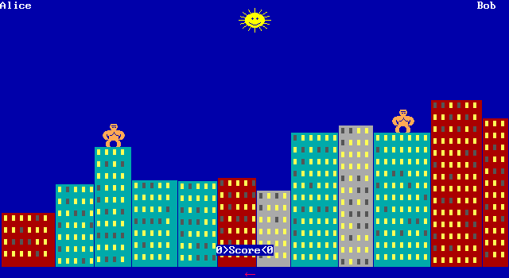

# gorilla-rust

[](https://github.com/abedegno/gorilla-rust/actions/workflows/ci.yml)
[](https://github.com/abedegno/gorilla-rust/releases)
[](LICENSE)
[](https://www.rust-lang.org)

A pixel-faithful Rust port of **GORILLAS**, the banana-throwing artillery game
Microsoft shipped with MS-DOS 5 in 1991 as a QBasic sample program.

Two gorillas stand on a city skyline. You type an angle and a velocity, and
throw an exploding banana at the other one. The wind pushes it sideways. The
buildings get holes in them. Whoever is still standing wins.

**[Play it in your browser](https://abedegno.github.io/gorilla-rust/)** —
the same code, compiled to WebAssembly. On a phone or tablet an on-screen
keypad appears for the angles and speeds, and its ABC key switches it to
letters for typing the players' names.



## What "pixel-faithful" means here

The original had no geometry model. `PlotShot` reads the screen with `POINT`
and branches on what colour it finds: sky, sun, gorilla, or building. The
explosions paint background-coloured circles, so a crater really does change
what the collision check reads. The framebuffer *is* the model.

Reproducing that means reproducing the drawing primitives exactly, down to
the rounding. So rather than reading the BASIC and writing what it looks
like it does, this port was built by **measuring the original running under
DOSBox** and testing against what came back.

Twenty framebuffer captures from the real thing are committed as fixtures.
The test suite compares the port's output against them byte for byte, and
the bar is zero differing pixels.

That process caught a lot that reading would not have:

| Measured | Not what you would assume |
|---|---|
| `CIRCLE`'s default aspect ratio | 0.73, not the 0.729166… that `(4/3) × (350/640)` gives |
| `LINE`'s error term | biased by `3 × dmaj / 4` |
| `PAINT` | stops at the fill colour as well as the border, or it never terminates |
| `POINT` off the screen | returns −1, not 0 — which the collision check reads as an impact |
| `CIRCLE`'s arc endpoints | use the raw aspect, where the rest of the arc uses a scaled one |

And a set of traps in BASIC itself, each of which produced a real bug before
it was caught:

- `/` is real division; `\` is the integer one. A real result stored into an
  `INTEGER` rounds **half to even**.
- `MOD` **rounds** its operand where a Rust `as i32` cast truncates.
- A literal like `.1` is **single** precision, so `t# = t# + .1` accumulates
  differently from a double `0.1`. After 60 steps the original holds
  6.000000089406967, not 5.9999999999999947.
- `DEFINT A-Z` reaches inside procedures, which quietly makes `Velocity` an
  integer. Type `50.5` at the prompt and the original throws at 50.
- QBasic passes **by reference**, so a `SUB` assigning to a parameter writes
  back into the caller's variable. That, not the `HITSELF` constant, is what
  makes hitting yourself score for your opponent.

## Install

Download a binary for your platform from
[Releases](https://github.com/abedegno/gorilla-rust/releases), or build it
from source as below.

**macOS:** the binary is not yet signed, so Gatekeeper blocks it the first
time. After extracting it, clear the quarantine flag once:

```sh
xattr -d com.apple.quarantine gorilla-rust
```

**Linux:** there are builds for x86_64 and arm64. The binary needs ALSA to
start, and X11 with Xcursor and xkbcommon to open its window. Most desktops
already have all of them; if it reports a missing library:

```sh
sudo apt-get install libasound2t64 libx11-6 libxcursor1 libxkbcommon0   # Ubuntu 24.04+, Debian 13+
sudo apt-get install libasound2 libx11-6 libxcursor1 libxkbcommon0      # older Debian and Ubuntu
sudo dnf install alsa-lib libX11 libXcursor libxkbcommon                # Fedora
```

Or install it with `cargo`, which builds locally and is not quarantined:

```sh
cargo install --git https://github.com/abedegno/gorilla-rust
```

### Building from source

```sh
git clone https://github.com/abedegno/gorilla-rust
cd gorilla-rust
cargo build --release
./target/release/gorilla-rust
```

To build on Linux you need the X11 and ALSA development headers:

```sh
sudo apt-get install libx11-dev libxkbcommon-dev libasound2-dev   # Debian/Ubuntu
sudo dnf install libX11-devel libxkbcommon-devel alsa-lib-devel   # Fedora
```

## Playing

```
gorilla-rust [--seed N] [--speed F] [--scale N] [--mute]
```

| Flag | Effect |
|---|---|
| `--seed N` | Fix the random seed, so a run repeats exactly |
| `--speed F` | Scale how fast everything runs. 1.0 is normal, 2.0 halves every delay |
| `--scale N` | Window scale factor. 2 is the default, giving 1280×700 |
| `--mute` | Turn off the PC-speaker sound |

On Windows the game opens without a console window. Run from a terminal,
the flags still print there, though the prompt may come back before the
output does.

Answer the prompts, pick `V` to watch the intro or `P` to go straight to a
game, then type an angle in degrees and a velocity. The wind arrow along the
bottom shows which way and how hard.

## Project layout

```
src/qb/      A small QBasic runtime: EGA mode 9, the drawing primitives,
             text and fonts, PLAY's MML parser, input, timing
src/game/    The translation of gorilla.bas itself
fixtures/    Framebuffer captures from the original, one byte per pixel
reference/   How the measurements were taken: the probe programs run
             under DOS, the tooling, and NOTES.md recording every finding
web/         The browser page, its build script and its Playwright tests
```

The split matters. `src/qb` knows nothing about gorillas — it is the slice of
QBasic the game uses, tested against captures of QBasic doing the same thing.
`src/game` is the part that would change if you ported a different `.BAS`.

## Testing

```sh
cargo test
```

111 tests: unit tests, 25 conformance tests comparing against the fixtures,
and playthrough tests that run headless games.

The conformance tests are the interesting ones. Each loads a capture from the
original and asserts the port produces the same pixels. When one fails it
prints the differing count and an ASCII view of the first difference, with
the original on the left and the port on the right.

To look at a fixture:

```sh
python3 reference/tools/bin2png.py fixtures/city.bin /tmp/city.png
python3 reference/tools/bin2png.py fixtures/sun.bin /tmp/diff.png --diff other.bin
```

## Deliberate differences from the original

Everything here is a decision, not an oversight. The full list with reasoning
is in [reference/NOTES.md](reference/NOTES.md).

- **The random number generator is not QBasic's.** Skylines differ by design.
  `--seed` reproduces a whole session instead, which the original could not
  do. Every fixture either avoids the generator or forces its inputs.
- **Timing is in real seconds.** The original calibrated a busy-wait against
  the host CPU speed. Some loops that relied on a 1990 PC being slow needed
  an explicit delay added, notably the sparkling border.
- **`SLEEP` is not interruptible.** The original let a keypress cut it short.
- **The `PLAY` frequency anchor is an assumption.** The note numbering and
  octaves were measured; which note number is middle C was not.

## Licence

MIT — see [LICENSE](LICENSE).

This is an independent reimplementation. It contains no Microsoft code.
GORILLAS.BAS, QBasic and MS-DOS are Microsoft's, and none of them are
distributed here; the original shipped with MS-DOS 5 and is easy to find if
you want to compare against it yourself.
